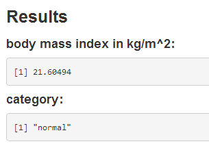

App for computing Body Mass Index 
========================================================
author: Miguel Picallo
date: August 2014

Body mass index
========================================================
left: 40%

The body mass index (BMI) is a measure computed out of the height and weight of a given person:

$$
BMI=\frac{weight(kg)}{height(m)^2}
$$


***

This value is then used to classify in different categories: 
- *underweight* for $BMI<18.5$
- *normal* for $BMI \in [18.5,25)$ 
- *overweight* for $BMI \in [25,30)$ 
- *obese* for $BMI \ge 30$ 


My example in the app
========================================================
left:40%

My example with height=1.78m and 68kg:

```r
height=1.78
weight=68
BMI=weight/
  height^2
BMI
```

```
[1] 21.46
```


***


Which falls into the category of *normal*.

How does it work: Inputs
========================================================
left: 60%

The app takes as inputs the height and the weight of a person, and the units of each:
- Height in centimeters or feet/inches (use only the principal input for centimeters, otherwise principal input is for feet and secondary for inches.)
- Weight in kilograms or pounds  

***


How does it work: Outputs
========================================================

Then it gives as results:
- BMI computed in $\frac{kg}{m^2}$ 
- category: underweight, normal, overweight or obese

***



